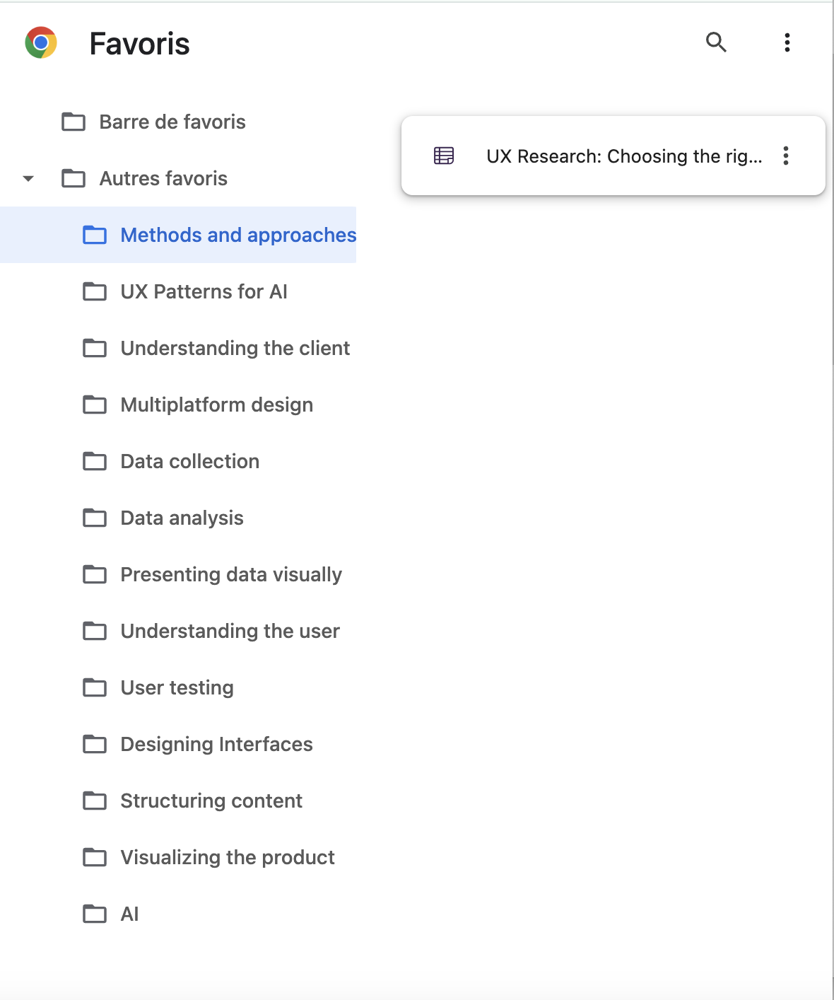

## How I Set Up My UX Research Tracking System

I’ve been saving content that I find interesting while scrolling on social media or browsing the web. Like most people, I rarely go back to my saved folder, forgetting about all those gems I found right when I could actually use them.

Creating this website made me think more seriously about how to track information that matters and build an easy-to-maintain system that helps me come back to those precious insights when needed.

## Mapping My Information Sources

The first thing I did was create a **mind map** of all the places where I find information about UX, sorted by category.

Here’s what it looks like.  It’s not final, I can always add new sources as I discover them.

## Dedicated Accounts and Newsletters

I then created a new **Google account just for UX tracking**. Having a fresh account means the recommendations are highly focused on UX, and the algorithm basically works for me. I see it as a dedicated research space.

I did the same on **Bluesky** and really enjoy its list and feed system. It makes it much easier to get relevant content on a specific topic and connect with people who share the same interests.

I also make sure to subscribe to **useful newsletters:** my favourites are the [**NN Group newsletter**](https://www.nngroup.com/articles/subscribe/) and the [**IxDF newsletter**.](https://www.interaction-design.org/newsletter?srsltid=AfmBOoo6Udy2g0FX5BTE-2B7hDZC4wPTYSglFAuMV2XsqddHNA-HTwH2)

On social media (mainly LinkedIn for more official content), I follow the main voices in UX to stay up to date with what’s happening in the field.

I recently started looking for UX conferences and events to attend.

## Finding the Right Filing System

The second step was to find a good **filing system** for storing all the articles, resources and media I come across.

Since I do most of my research online, I set up a structure in Google Favourites to organise resources into folders by category (for example: *UX Methods*, *Data Collection*, *User Testing*).

I already had lots of things saved on social media, and I didn’t want to export everything manually, so I decided to **categorise my folders** and set up a **weekly review**.

Once a week, I go through everything I’ve saved across platforms and sort what’s useful for current or future projects, what topics are trending, and what’s worth exploring later.

## Moving to a More Lasting System

I’ve recently started using **Obsidian** to store everything I find online and on social media. It’s still in an early stage, but the goal is to have a single place where I can keep all my saved media, links, and notes in one organised space.

I still have some way to go before finding the perfect tracking method, but I’m excited to keep improving the system and learn new strategies as I go.